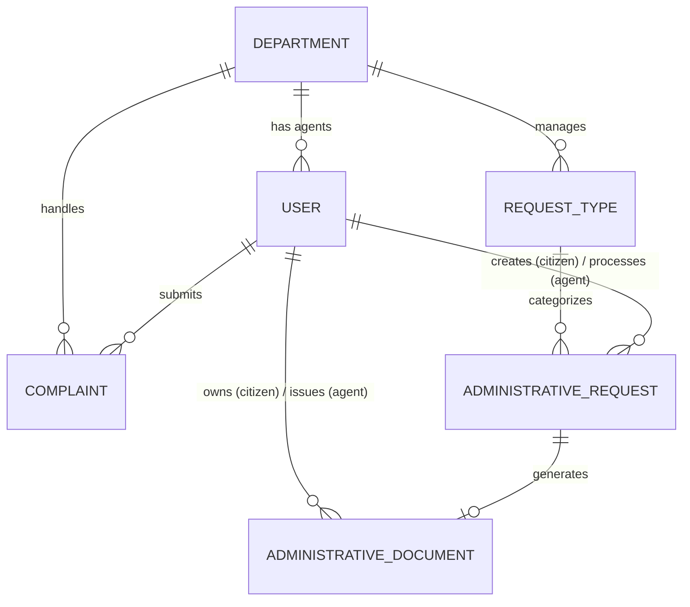

# Plan de Refactoring Architecture Backend - TerangaSkills

## 1. Analyse de l'architecture actuelle
Le backend NestJS actuel (dans `TerangasSkillsBack`) utilise une approche Domain Driven Design (DDD) / Clean Architecture avec Prisma et PostgreSQL. 
Les rôles actuels incluent `SUPER_ADMIN` (prévu pour le multi-mairie), `ADMIN`, `AGENT`, `NEIGHBORHOOD_CHIEF` et `CITIZEN`.
Les demandes administratives utilisent un enum statique (`AdministrativeRequestType`), limitant l'extensibilité.
Le statut des demandes (`RequestStatus`) et le workflow documentaire actuel sont asynchrones mais manquent de la granularité requise pour intégrer les étapes de validation par l'admin et de paiement.

## 2. Liste des impacts
- **Sécurité (RBAC & Guards) :** Suppression du rôle `SUPER_ADMIN` et `NEIGHBORHOOD_CHIEF`. Modification des Guards pour restreindre l'Agent uniquement à son département.
- **Base de données :**
  - Ajout des modèles `Department` et `RequestType`.
  - Modification de `User` pour inclure `departmentId`.
  - Refonte de `AdministrativeRequest` pour pointer vers `RequestType`.
  - Renommage de `Document` en `AdministrativeDocument` avec relation stricte vers `User` (Agent et Citoyen).
  - Modification de `RequestStatus`.
- **Logique Métier :**
  - Attribution automatique des réclamations au département VOIRIE.
  - Le workflow des demandes administratives est étendu à 8 statuts stricts.
  - Séparation entre la génération du document (PROCESSED) et le droit de téléchargement (COMPLETED, après paiement).
- **Frontend (TerangaSkillsMobile) :**
  - Les enums `Role` et `RequestStatus` devront être synchronisés.
  - Les requêtes de création de demande devront fetcher les `RequestType` dynamiquement plutôt que d'utiliser des valeurs statiques.

## 3. Nouveau modèle de données Prisma (schema.prisma)

```prisma
enum Role {
  ADMIN
  AGENT
  CITIZEN
}

enum RequestStatus {
  SUBMITTED
  ASSIGNED
  IN_PROGRESS
  PROCESSED
  VALIDATED
  AWAITING_PAYMENT
  COMPLETED
  REJECTED
}

model Department {
  id            String        @id @default(uuid())
  name          String        @unique // ETAT_CIVIL, URBANISME, AFFAIRES_SOCIALES, VOIRIE
  description   String?
  agents        User[]
  requestTypes  RequestType[]
  complaints    Complaint[]
}

model RequestType {
  id            String                  @id @default(uuid())
  name          String                  @unique // Acte de naissance, etc.
  description   String?
  departmentId  String
  department    Department              @relation(fields: [departmentId], references: [id])
  requests      AdministrativeRequest[]
}

model User {
  id                    String                  @id @default(uuid())
  email                 String                  @unique
  password              String
  firstName             String
  lastName              String
  phone                 String?
  role                  Role                    @default(CITIZEN)
  isActive              Boolean                 @default(true)
  refreshToken          String?
  
  departmentId          String?
  department            Department?             @relation(fields: [departmentId], references: [id])
  
  createdAt             DateTime                @default(now())
  updatedAt             DateTime                @updatedAt

  administrativeRequests AdministrativeRequest[] @relation("CitizenRequests")
  assignedRequests       AdministrativeRequest[] @relation("AssignedAgent")
  complaints            Complaint[]
  missingDocumentsReports MissingDocument[]
  actions               ActionLog[]
  documentsReceived     AdministrativeDocument[] @relation("CitizenDocs")
  documentsIssued       AdministrativeDocument[] @relation("AgentDocs")
}

model AdministrativeRequest {
  id              String                    @id @default(uuid())
  title           String
  description     String
  data            Json?
  attachments     String[]
  status          RequestStatus             @default(SUBMITTED)
  
  requestTypeId   String
  requestType     RequestType               @relation(fields: [requestTypeId], references: [id])
  
  citizenId       String
  citizen         User                      @relation("CitizenRequests", fields: [citizenId], references: [id])
  
  assignedAgentId String?
  assignedAgent   User?                     @relation("AssignedAgent", fields: [assignedAgentId], references: [id])

  createdAt       DateTime                  @default(now())
  updatedAt       DateTime                  @updatedAt

  document        AdministrativeDocument?
  history         ActionLog[]
}

model AdministrativeDocument {
  id              String                 @id @default(uuid())
  documentNumber  String                 @unique
  fileUrl         String
  qrCode          String?                @unique
  status          String                 @default("VALID")
  
  citizenId       String
  citizen         User                   @relation("CitizenDocs", fields: [citizenId], references: [id])
  
  agentId         String
  agent           User                   @relation("AgentDocs", fields: [agentId], references: [id])
  
  requestId       String                 @unique
  request         AdministrativeRequest  @relation(fields: [requestId], references: [id])

  issuedAt        DateTime               @default(now())
  createdAt       DateTime               @default(now())
}

model Complaint {
  id              String          @id @default(uuid())
  title           String
  description     String
  photoUrl        String?
  latitude        Float?
  longitude       Float?
  status          ComplaintStatus @default(OPEN)

  citizenId       String
  citizen         User            @relation(fields: [citizenId], references: [id])

  departmentId    String?
  department      Department?     @relation(fields: [departmentId], references: [id])

  createdAt       DateTime        @default(now())
  updatedAt       DateTime        @updatedAt

  history         ActionLog[]
}
```

## 4. Diagramme des relations



## 5. Nouveaux DTOs
- `CreateDepartmentDto`, `UpdateDepartmentDto`
- `CreateRequestTypeDto`
- `AssignAgentDto` (Admin -> Request)
- `ProcessRequestDto` (Agent uploads document)
- `ValidateDocumentDto` (Admin)
- `ProcessPaymentDto` (Mock pour le paiement)

## 6. Nouveaux Services
- `DepartmentService` : Gestion du CRUD des départements et types de demandes.
- `PaymentService` : Abstraction pour la validation de paiements (Wave, Orange Money). Interface générique appelable depuis le workflow.
- `DashboardAnalyticsService` : Agréger les nouvelles metrics métiers.

## 7. Plan d'exécution Git & Migration
Je vais exécuter ces actions directement :
1. `git branch develop` (Création de la branche principale de dév).
2. `git checkout -b feature/refactoring-schema` (Mise à jour du schéma Prisma et seed).
3. `git commit & push`
4. `git checkout -b feature/departments-roles` (Mise à jour de l'Auth, Users, RBAC, Services Department).
5. `git commit & push`
6. `git checkout -b feature/workflow-demandes` (Refonte logique de `AdministrativeRequestService` et Document).
7. `git commit & push`
8. `git checkout -b feature/dashboard-stats` (Refonte du dashboard analytique).
9. `git commit & push`
